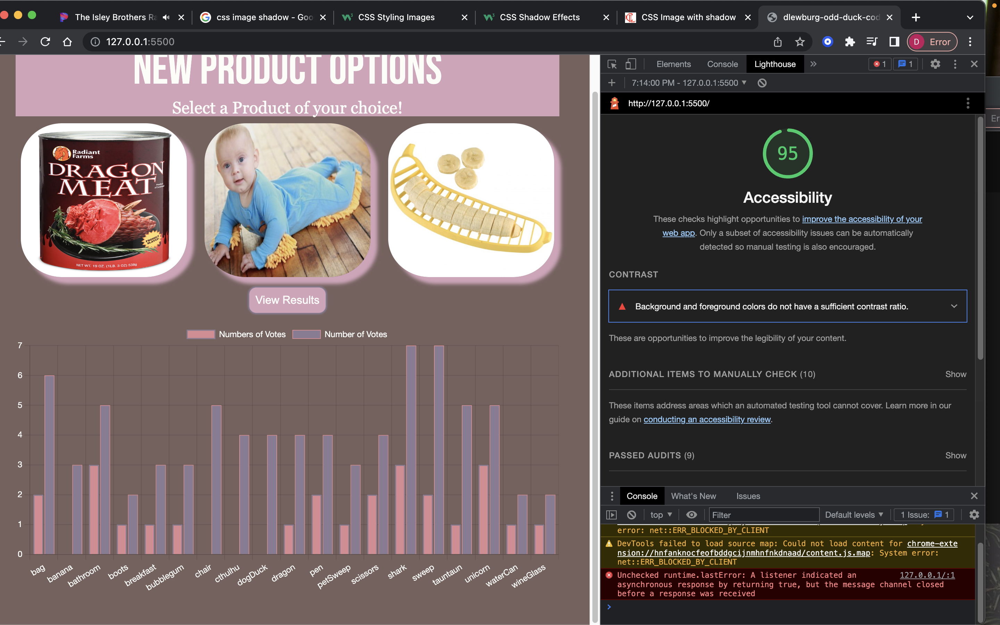

# Lab - 11

## Odd-Duck

Takes a poll of a user's preferred product out of three randomly selected images in an array. The number of votes and each time a product is shown is counted and displayed with a chart.

### Author

Created by: Dasha Burgos

Assisted By: Raul(TA); Tammy(TA); Tony(TA); Audrey P. (Instructor)

### Links and Resources

[In Class Demo](https://github.com/codefellows/seattle-code-201d97/tree/main/class-11/inclass-demo)
[Arrays](https://replit.com/@arpatterson31/Class-201d97-More-Array-Methods#index.js)
[Color Scheme](http://colormind.io/bootstrap/)
[Image Shadows](http://www.corelangs.com/css/box/image-shadow.html)
[Chart Deployment and Styling](https://www.chartjs.org/docs/latest/general/options.html)

### Lighthouse Accessibility Report Score

### Reflections and Comments

This lab allowed me to review and apply all the knowledge that has been taught throughout the past two weeks with introducing understandable concepts of Event Listeners and Charts. CSS is always a work in progress and I am looking forward to becoming efficient in my technical skills.
