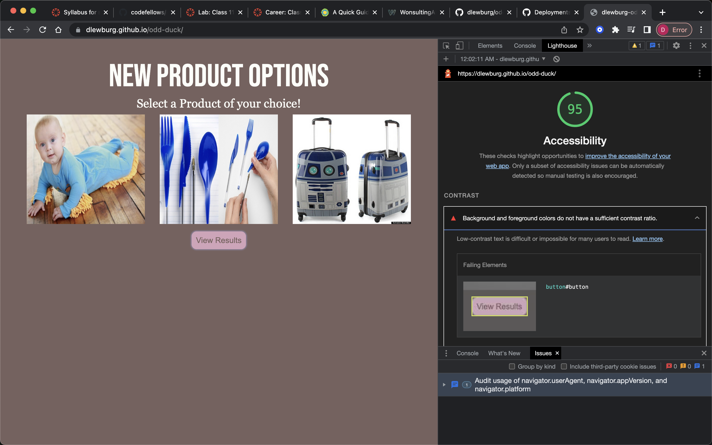

# Lab - 11

## Odd-Duck

//what the app does

### Author

Created by: Dasha Burgos

Assisted By: Raul(TA); Tammy(TA); Tony(TA);

### Links and Resources

[In Class Demo](https://github.com/codefellows/seattle-code-201d97/tree/main/class-11/inclass-demo)

### Lighthouse Accessibility Report Score

### Reflections and Comments
